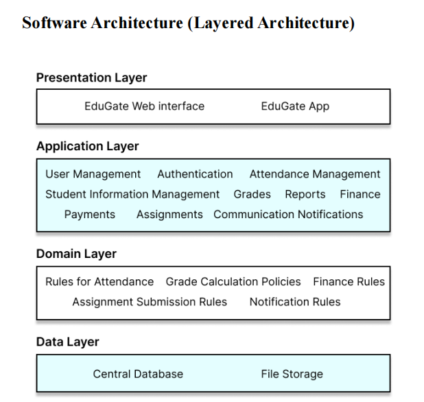
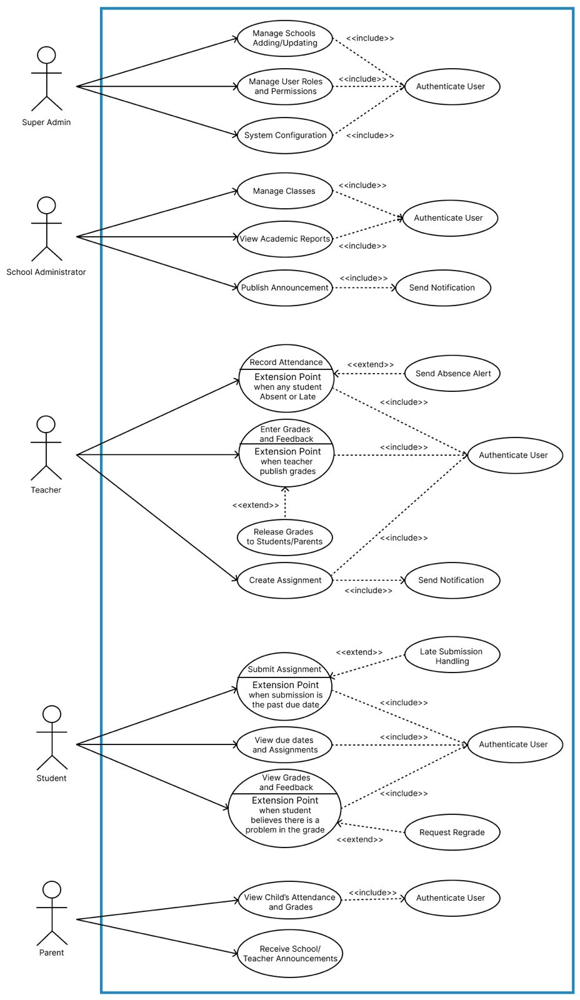
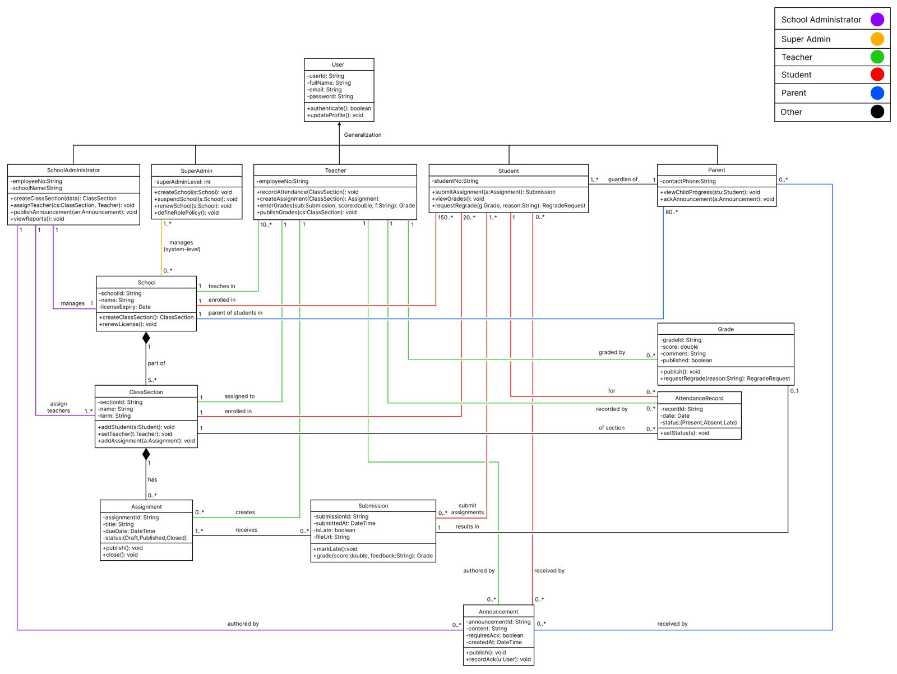

# EduGate: Multilingual School Management System

### [🔗 Live Demo - Visit the Platform](https://www.edugete.tech/)

## 📌 Project Overview
**EduGate** is a centralized, multilingual school management platform designed to streamline administrative tasks and improve communication between administrators, teachers, students, and parents. Developed as part of the **CPIT-251 (Software Analysis and Design)** course, the system emphasizes modularity, scalability, and humanitarian impact by making educational tools accessible in **Arabic, English, and French**.

---

## 🚀 Key Features
* **Multilingual Support**: Seamless switching between Arabic, English, and French interfaces.
* **Role-Based Access Control**: Customized dashboards for Admins, Teachers, Students, and Parents.
* **Academic Management**: Efficient tools for attendance tracking, grading, and course enrollment.
* **Financial & Reports**: Modules for fee management and automated academic reporting.
* **Real-time Interaction**: (Since it's on a live server) Web-based accessibility for real-time data updates.

---

## 🏗 System Architecture
The project is built using a **Layered Architecture** to ensure a clean separation of concerns:

1.  **Presentation Layer**: Built with **Python (Web)** for a responsive and user-friendly interface.
2.  **Application Layer**: Handles the business logic and manages interaction between users and data.
3.  **Domain Layer**: Contains the core business rules (GPA calculations, attendance policies, etc.).
4.  **Data Layer**: Manages persistent storage and data integrity.

---

## 📊 System Modeling & Diagrams
The design phase followed rigorous engineering standards, documented in the `/diagrams` folder:
* **Use Case Diagram**: Defines all user interactions and system boundaries.
* 
* **Sequence Diagrams**: Detailed flow for core processes like grading and section creation.
* **Class Diagram**: A blueprint of the system's structural components.
* 
* **Architecture Diagram**: Visualization of the layered structural approach.

---

## 🛠 Tech Stack
* **Backend/Logic**: Python
* **Prototyping**: Java
* **Design**: Figma & Canva
* **Testing**: JUnit (Java Version) & Pytest (Python Version)
* **Methodology**: Agile (Scrum/Sprints)

---

## 🧪 Quality Assurance
We followed a strict testing protocol to ensure system reliability:
* Automated **Unit Testing** for all business logic.
* **100% pass rate** for critical test cases (Authentication, Attendance, and Grading).

---

## 👥 Contributors
* **Munthir Alfarsi** – Project Lead & System Architect
* Hashim Bajaber
* Abdulaziz Melebari
* Rami Alyazedy
* Abdoul Malick Cisse

---
